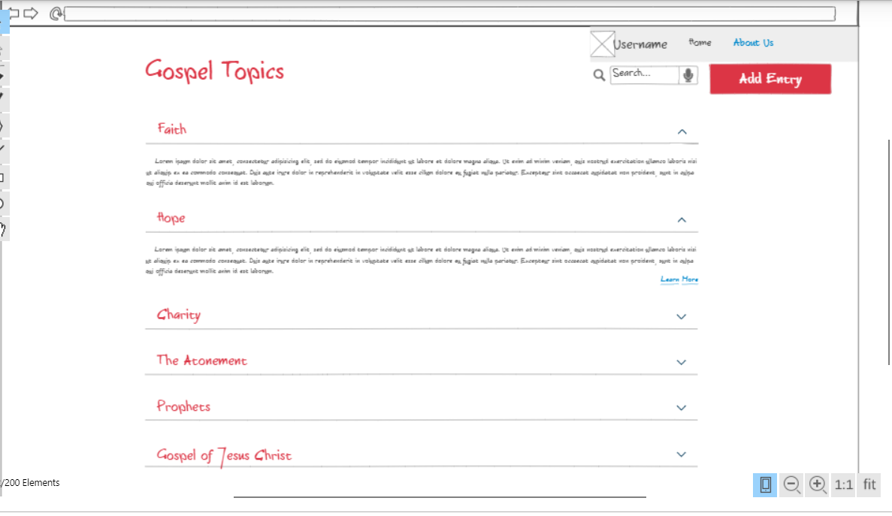

##### scripsights.click
##### startup.scripsights.click
##### Elastic IP: 44.194.9.45

# Scripture Insights

### Startup Service

- [x] - done - Prerequisite: Simon Service deployed to production environment
- [x] - done - Prerequisite: A link to GitHub startup repository prominently displayed on application's home page
- [x] - done - Prerequisite: Notes in startup Git repository README.md file
- [x] - done - Prerequisite: At least 10 git commits spread consistently throughout the assignment period
- [x] - done - Created an HTTP service using Node.js and Express
- [x] - done - Frontend served up using Express static middleware
- [x] - done - Third party service endpoints: inspirational quotes on main page
- [x] - done - Backend provides service endpoints: endpoints for retrieving and submitting user entries
- [x] - done - Frontend calls service endpoints: above endpoints for entries

### Javascript Deliverables

- [x] - done - Prerequisite: Simon Javascript deployed to your production environment
- [x] - done - Prerequisite: A link to your GitHub startup repository prominently displayed on your application's home page
- [x] - done - Prerequisite: Notes in your startup Git repository README.md file
- [x] - done - Added Javascript support for future login with username and password
- [x] - done - Added Javascript for future database data for scripsight submissions
- [x] - done - Added Javascript support for Websocket displaying entries on discover.html
- [x] - done - Added Javascript for interaction logic: form submission, logging in, selecting collapsible lists

### CSS Deliverables

- [x] - done - Prerequisite: Simon CSS deployed to your production environment
- [x] - done - Prerequisite: A link to your GitHub startup repository prominently displayed on your application's home page
- [x] - done - Prerequisite: Notes in your startup Git repository README.md file
- [x] - done - 30% Header, footer, and main content body. Used flex to layout sections.
- [x] - done - 20% Navigation elements. Links highlight on hover.
- [x] - done - 10% Responsive to window resizing. Looks great on iPad, desktop, and iPhone.
- [x] - done - 20% Application elements.
- [x] - done - 10% Application text content.
- [x] - done - 10% Application images. Varied image format based on screen size

### HTML Additions

#### Created 3 webpages: one for login, one for "discovering" scripture entries and one for sharing scripture entries
##### Login (index.html): simple welcome page for users to enter their login and password in order to access the rest of the website
##### Discover: Users will see a variety of gospel topics. Pending database and websocket to allow for the submission and display of entries pertaining to each topic
##### Share: Users can enter information into textboxes regarding favorite scriptures and insights regarding the scriptures. Currently the "Submit" button has no effect. Need Websocket and Database to store and display entries

## Description deliverable

### Elevator pitch

Have you ever sat in Sacrament meeeting or Sunday School and heard an insight about a scripture that you had never considered before? Something that changed the way you view a certain gospel topic, or enhanced your understanding of Heavenly Father's plan of salvation, or the Atonement of Jesus Christ? What if there was a way to easiliy receive such insights and share your own knowledge and experience with certain scriptures outside of a church setting? The Scripture Insights application allows you to scroll through a number of gospel topics filled with entries made by normal people like yourself. It also gives you the option to post your own entries, including a scripture and your own thoughts about it, to inspire yourself and others through your experiences as a disciple of Jesus Christ.

### Design

Here's the main page which will display a list of topics, each with a dropdown that will show all entries that have been submitted for that topic.

### Key features

- Secure login over HTTPS
- Ability to view entries from a variety of Gospel topics and themes
- Ability to create an entry that will be added to the homepage to be viewed by others
- As part of creating the entry, user can select a topic and write their insights
- Option to display your name or remain anonymous
- Entries are persistently stored
- Option for users to provide feedback. "The topic I want to write about isn't listed!"
- Ability for admin to delete inappropriate entries

### Technologies

I am going to use the required technologies in the following ways.

- **HTML** - Uses correct HTML structure for application. Three HTML pages. One for login, one for viewing entries and one for creating entries.
- **CSS** - Application styling that fits regardless if on a phone, computer, or tablet. Uses good whitespace, color choice and contrast.
- **JavaScript** - Provides login, buttons for adding entries, popdowns for viewing topics, displaying entries from other users, backend endpoint calls.
- **Service** - Backend service with endpoints for:
  - login
  - retrieving entries
  - submitting entries
  - submitting username
- **DB/Login** - Store users and entries in database. Register and login users. Credentials securely stored in database. Can't add entry unless authenticated.
- **WebSocket** - When an entry is added, it becomes visible to be seen by all other users.
- **React** - Application ported to use the React web framework.

